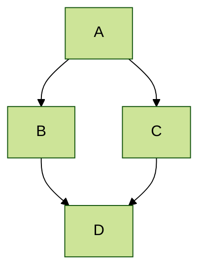

Projects Completed 
=====

## Projects - 1: Building a whole brain model to understand Functional Connectivity from Structural Connectivity. 

This work proposes a phenomenological whole-brain model in which each brain region is represented by a Hopf oscillator, capturing the transition between noisy and oscillatory neural dynamics. The oscillators are coupled through the underlying structural connectivity network, while interactions between regions are modeled using power-coupling, which enables stable phase relationships among oscillators operating at different intrinsic frequencies. This formulation allows the model to capture cross-frequency phase interactions and large-scale synchronization patterns observed in empirical brain signals. By integrating neuroimaging-derived connectivity with nonlinear dynamical systems, the framework provides an efficient and biologically interpretable approach to modeling whole-brain dynamics and emergent functional connectivity. 

The model has-
* Learnable rule for intrinsic frequences of Hopf-oscillator.
* Introduced an unspervised learning rule- Complex Hebbian learning to decipher the phase relationship among oscillators.
* Impact of Structural prunning on functional information of the brain.
* Modification of the oscillator network parameters can restore the functional alteration, providing possible clinical application of the model.

*Figure: Whole-brain network model using coupled Hopf oscillators with power coupling.*

*Taken from [https://doi.org/10.1038/s41598-023-43547-3](https://doi.org/10.1038/s41598-023-43547-3)*

### Related Publication
🔗 Bandyopadhyay, A., Ghosh, S., Biswas, D. et al. A phenomenological model of whole brain dynamics using a network of neural oscillators with power-coupling. Sci Rep 13, 16935 (2023). [https://doi.org/10.1038/s41598-023-43547-3](https://doi.org/10.1038/s41598-023-43547-3)

🔗 Bandyopadhyay, A., Ghosh, S., Biswas, D., Surampudi, R.B., Chakravarthy, V.S. (2023). A Phenomenological Deep Oscillatory Neural Network Model to Capture the Whole Brain Dynamics in Terms of BOLD Signal. In: Tanveer, M., Agarwal, S., Ozawa, S., Ekbal, A., Jatowt, A. (eds) Neural Information Processing. ICONIP 2022. Lecture Notes in Computer Science, vol 13624. Springer,[https://doi.org/10.1007/978-3-031-30108-7_14](https://doi.org/10.1007/978-3-031-30108-7_14)

🔗  Bandyopadhyay, A., Ghosh, S., Biswas, D., Surampudi, R.B., Chakravarthy, V.S. (2023).A trainable oscillatory neural network for modelling BOLD signals, SFN, 2022


## Projects - 2: A Mechanistic model to capture simultaneous EEG-fMRI DATA.

This work presents a mechanistic whole-brain modeling framework designed to simultaneously capture electrophysiological and hemodynamic brain signals. The model integrates neural population dynamics with structural connectivity to generate oscillatory activity consistent with EEG recordings, while a hemodynamic forward model maps the neural activity to BOLD signals observed in fMRI. By jointly modeling these two modalities, the framework provides a unified approach to linking fast neuronal oscillations with slower hemodynamic responses, enabling a deeper understanding of the mechanisms underlying multimodal brain signals and large-scale brain dynamics. 

* This is the first kind of model that intends to capture the contrasting spatiotemporal brain rhythm pattern of BOLD and EEG signal.
* The model discards the traditional Haemodynamic response function (HRF) , as a convolotion operator for neuroal signal, as such HRF has significant variability across regions.
* The model introdcues a learning rule to capture the relationship between low-frequency fMRI and high-frequency EEG signals.
* The model shows the importance of Structural connectivity, and the impact of structural pruning on functional information, modularity, and integration-segregation.

*Figure: An integrated neuro-hemodynamic whole-brain model.*

*Taken from [https://doi.org/10.1038/s41598-023-43547-3](https://doi.org/10.1038/s41598-023-43547-3)*


 ### Related Publication
🔗 Anirban Bandyopadhyay, V Srinivasa Chakravarthy, Dipanjan Roy, A mechanistic whole brain model to capture simultaneous EEG-fMRI data, Cerebral Cortex, Volume 36, Issue 1, January 2026, bhag002, 
[https://doi.org/10.1093/cercor/bhag002](https://doi.org/10.1093/cercor/bhag002)

 🔗 Anirban Bandyopadhyay, V Srinivasa Chakravarthy, Dipanjan Roy, An integrated neuro-hemodynamic whole-brain model with a trainable
network of nonlinear oscillators, COSYNE, 2026.  

Projects Ongoing
====


## MathJax 

Support for MathJax (version 3.* via [jsDelivr](https://www.jsdelivr.com/), [documentation](https://docs.mathjax.org/en/latest/)) is included in the template:

$$
\displaylines{
\nabla \cdot E= \frac{\rho}{\epsilon_0} \\\
\nabla \cdot B=0 \\\
\nabla \times E= -\partial_tB \\\
\nabla \times B  = \mu_0 \left(J + \varepsilon_0 \partial_t E \right)
}
$$

The default delimiters of `$$...$$` and `\\[...\\]` are supported for displayed mathematics, while `\\(...\\)` should be used for in-line mathematics (ex., \\(a^2 + b^2 = c^2\\))

**Note** that since Academic Pages uses Markdown which cases some interference with MathJax and LaTeX for escaping characters and new lines, although [some workarounds exist](https://math.codidact.com/posts/278763/278772#answer-278772). In some cases, such as when you are including MathJax in a `citation` field for publications, it may be necessary to use `\(...\)` for inline delineation.

## Mermaid diagrams
Academic Pages includes support for [Mermaid diagrams](https://mermaid.js.org/) (version 11.* via [jsDelivr](https://www.jsdelivr.com/)) and in addition to their [tutorials](https://mermaid.js.org/ecosystem/tutorials.html) and [GitHub documentation](https://github.com/mermaid-js/mermaid) the basic syntax is as follows:

```markdown
    ```mermaid
    graph LR
    A-->B
    ```
```

Which produces the following plot with the [default theme](https://mermaid.js.org/config/theming.html) applied:


While a more advanced plot with the `forest` theme applied looks like the following:



## Plotly
Academic Pages includes support for Plotly diagrams via a hook in the Markdown code elements, although those that are comfortable with HTML and JavaScript can also access it [via those routes](https://plotly.com/javascript/getting-started/). Plotly is included via an `npm` [package](https://www.npmjs.com/package/plotly.js?activeTab=readme) and is distributed as part of the minimized JavaScript that is part of the template.

In order to render a Plotly plot via Markdown the relevant plot data need to be added as follows:

```markdown
    ```plotly
    {
      "data": [
        {
          "x": [1, 2, 3, 4],
          "y": [10, 15, 13, 17],
          "type": "scatter"
        },
        {
          "x": [1, 2, 3, 4],
          "y": [16, 5, 11, 9],
          "type": "scatter"
        }
      ]
    }
    ```
```

**Important!** Since the data is parsed as JSON *all* of the keys will need to be quoted for the plot to render. The use of a tool like [JSONLint](https://jsonlint.com/) to check syntax is highly recommended.
{: .notice}

Which produces the following:
```plotly
{
  "data": [
    {
      "x": [1, 2, 3, 4],
      "y": [10, 15, 13, 17],
      "type": "scatter"
    },
    {
      "x": [1, 2, 3, 4],
      "y": [16, 5, 11, 9],
      "type": "scatter"
    }
  ]
}
```

Essentially what is taking place is that the [Plotly attributes](https://plotly.com/javascript/reference/index/) are being taken from the code block as JSON data, parsed, and passed to Plotly along with a theme that matches the current site theme (i.e., a light theme, or a dark theme). This allows all plots that can be described via the `data` attribute to rendered with some limitations for the theme of the plot.

```plotly
{
  "data": [
    {
      "x": [1, 2, 3, 4, 5],
      "y": [1, 6, 3, 6, 1],
      "mode": "markers",
      "type": "scatter",
      "name": "Team A",
      "text": ["A-1", "A-2", "A-3", "A-4", "A-5"],
      "marker": { "size": 12 }
    },
    {
      "x": [1.5, 2.5, 3.5, 4.5, 5.5],
      "y": [4, 1, 7, 1, 4],
      "mode": "markers",
      "type": "scatter",
      "name": "Team B",
      "text": ["B-a", "B-b", "B-c", "B-d", "B-e"],
      "marker": { "size": 12 }
    }    
  ],
  "layout": {
    "xaxis": {
      "range": [ 0.75, 5.25 ]
    },
    "yaxis": {
      "range": [0, 8]
    },
    "title": {"text": "Data Labels Hover"}
  }
}
```

```plotly
{
  "data": [{
      "x": [1, 2, 3],
      "y": [4, 5, 6],
      "type": "scatter"
    },
    {
      "x": [20, 30, 40],
      "y": [50, 60, 70],
      "xaxis": "x2",
      "yaxis": "y2",
      "type": "scatter"
  }],
  "layout": {
    "grid": {
      "rows": 1,
      "columns": 2,
      "pattern": "independent"
    },
    "title": {
      "text": "Simple Subplot"
    }    
  }
}
```

```plotly
{
  "data": [{
		"z": [[10, 10.625, 12.5, 15.625, 20],
          [5.625, 6.25, 8.125, 11.25, 15.625],
          [2.5, 3.125, 5.0, 8.125, 12.5],
          [0.625, 1.25, 3.125, 6.25, 10.625],
          [0, 0.625, 2.5, 5.625, 10]],
		"type": "contour"
	}],
  "layout": {
    "title": {
      "text": "Basic Contour Plot"
    }
  }
}
```

## Markdown guide

Academic Pages uses [kramdown](https://kramdown.gettalong.org/index.html) for Markdown rendering, which has some differences from other Markdown implementations such as GitHub's. In addition to this guide, please see the [kramdown Syntax page](https://kramdown.gettalong.org/syntax.html) for full documentation.  

### Header three

#### Header four

##### Header five

###### Header six

## Blockquotes

Single line blockquote:

> Quotes are cool.

## Tables

### Table 1

| Entry            | Item   |                                                              |
| --------         | ------ | ------------------------------------------------------------ |
| [John Doe](#)    | 2016   | Description of the item in the list                          |
| [Jane Doe](#)    | 2019   | Description of the item in the list                          |
| [Doe Doe](#)     | 2022   | Description of the item in the list                          |

### Table 2

| Header1 | Header2 | Header3 |
|:--------|:-------:|--------:|
| cell1   | cell2   | cell3   |
| cell4   | ce
ll5   | cell6   |
|-----------------------------|
| cell1   | cell2   | cell3   |
| cell4   | cell5   | cell6   |
|=============================|
| Foot1   | Foot2   | Foot3   |

## Definition Lists

Definition List Title
:   Definition list division.

Startup
:   A startup company or startup is a company or temporary organization designed to search for a repeatable and scalable business model.

#dowork
:   Coined by Rob Dyrdek and his personal body guard Christopher "Big Black" Boykins, "Do Work" works as a self motivator, to motivating your friends.

Do It Live
:   I'll let Bill O'Reilly [explain](https://www.youtube.com/watch?v=O_HyZ5aW76c "We'll Do It Live") this one.

## Unordered Lists (Nested)

  * List item one 
      * List item one 
          * List item one
          * List item two
          * List item three
          * List item four
      * List item two
      * List item three
      * List item four
  * List item two
  * List item three
  * List item four

## Ordered List (Nested)

  1. List item one 
      1. List item one 
          1. List item one
          2. List item two
          3. List item three
          4. List item four
      2. List item two
      3. List item three
      4. List item four
  2. List item two
  3. List item three
  4. List item four

## Buttons

Make any link standout more when applying the `.btn` class.

## Notices

Basic notices or call-outs are supported using the following syntax:

```markdown
**Watch out!** You can also add notices by appending `{: .notice}` to the line following paragraph.
{: .notice}
```

which wil render as:

**Watch out!** You can also add notices by appending `{: .notice}` to the line following paragraph.
{: .notice}

### Footnotes

Footnotes can be useful for clarifying points in the text, or citing information.[^1] Markdown support numeric footnotes, as well as text as long as the values are unique.[^note]

```markdown
This is the regular text.[^1] This is more regular text.[^note]

[^1]: This is the footnote itself.
[^note]: This is another footnote.
```

[^1]: Such as this footnote.
[^note]: When using text for footnotes markers, no spaces are permitted in the name.

## HTML Tags

### Address Tag

<address>
  1 Infinite Loop<br /> Cupertino, CA 95014<br /> United States
</address>

### Anchor Tag (aka. Link)

This is an example of a [link](https://github.com "GitHub").

### Abbreviation Tag

The abbreviation CSS stands for "Cascading Style Sheets".

*[CSS]: Cascading Style Sheets

### Cite Tag

"Code is poetry." ---<cite>Automattic</cite>

### Code Tag

You will learn later on in these tests that `word-wrap: break-word;` will be your best friend.

You can also write larger blocks of code with syntax highlighting supported for some languages, such as Python:

```python
print('Hello World!')
```

or R:

```R
print("Hello World!", quote = FALSE)
```

### Details Tag (collapsible sections)

The HTML `<details>` tag works well with Markdown and allows you to include collapsible sections, see [W3Schools](https://www.w3schools.com/tags/tag_details.asp) for more information on how to use the tag.

<details>
  <summary>Collapsed by default</summary>
  This section was collapsed by default!
</details>

The source code:

```HTML
<details>
  <summary>Collapsed by default</summary>
  This section was collapsed by default!
</details>
```

Or, you can leave a section open by default by including the `open` attribute in the tag:

<details open>
  <summary>Open by default</summary>
  This section is open by default thanks to open in the &lt;details open&gt; tag!
</details>


### Emphasize Tag

The emphasize tag should _italicize_ text.

### Insert Tag

This tag should denote <ins>inserted</ins> text.

### Keyboard Tag

This scarcely known tag emulates <kbd>keyboard text</kbd>, which is usually styled like the `<code>` tag.

### Preformatted Tag

This tag styles large blocks of code.

<pre>
.post-title {
  margin: 0 0 5px;
  font-weight: bold;
  font-size: 38px;
  line-height: 1.2;
  and here's a line of some really, really, really, really long text, just to see how the PRE tag handles it and to find out how it overflows;
}
</pre>

### Quote Tag

<q>Developers, developers, developers&#8230;</q> &#8211;Steve Ballmer

### Strike Tag

This tag will let you <strike>strikeout text</strike>.

### Strong Tag

This tag shows **bold text**.

### Subscript Tag

Getting our science styling on with H<sub>2</sub>O, which should push the "2" down.

### Superscript Tag

Still sticking with science and Isaac Newton's E = MC<sup>2</sup>, which should lift the 2 up.

### Variable Tag

This allows you to denote <var>variables</var>.

***
**Footnotes**

The footnotes in the page will be returned following this line, return to the section on <a href="#footnotes">Markdown Footnotes</a>.

